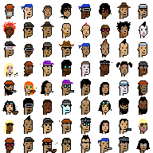
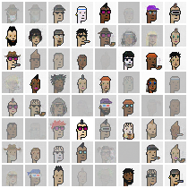
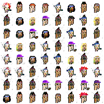
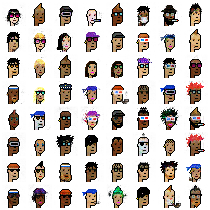

# CryptoPunks GAN

Simple [SN-GAN](https://arxiv.org/abs/1802.05957) to generate
[CryptoPunks](https://www.larvalabs.com/cryptopunks). Neural network
architecture and training code has been modified from the
[PyTorch DCGAN example](pytorch/examples/blob/master/dcgan/).
See [Notes](#notes) for more information.


*Punks during training*



*Linear interpolation between two punks*

# Usage

## Example

Generate 64 punks using pretrained model:

```python
import torch
from torchvision.utils import save_image
from train import Generator

model = Generator()
model.load_state_dict(torch.load("models/net_g_epoch_999.pth"))
z = torch.randn(64, 100, 1, 1)
punks = model(z)
save_image(punks, "punks.png", normalize=True)
```


## Train

On CUDA machine:

```bash
python train.py
```

Check `out` directory for weights and sample images.

# Notes

Using [Spectral
Normalization](https://christiancosgrove.com/blog/2018/01/04/spectral-normalization-explained.html)
created very nice punks, but had a tendency to create very transparent ones:



Using batch normalization seems to negate this, but causes mode collapse



Instead, penalizing the model for a high mean alpha produces very good punks,
with no transparency issues:

```python
# minimize criterion + mean of alpha channel
loss_g = criterion(output, label) + fake[:, -1].mean()
```



In order to encourage more variety in the outputs, we generate a feature matrix
of all the punks (using
[punks.attributes](https://github.com/cryptopunksnotdead/punks.attributes)):

```
    3D Glasses  Bandana  Beanie  Big Beard  Big Shades  ...  Ape  Human  Zombie  Female  Male
id                                                      ...
0            0        0       0          0           0  ...    0      1       0       1     0
1            0        0       0          0           0  ...    0      1       0       0     1
2            0        0       0          0           0  ...    0      1       0       1     0
3            0        0       0          0           0  ...    0      1       0       0     1
4            0        0       0          0           1  ...    0      1       0       0     1
```

For each image in the batch, randomly select an attribute (column), and then
randomly select a punk that has that attribute. This ensures that the
discriminator is exposed to all of the attributes in a more balanced manor than
running through all the punks.
